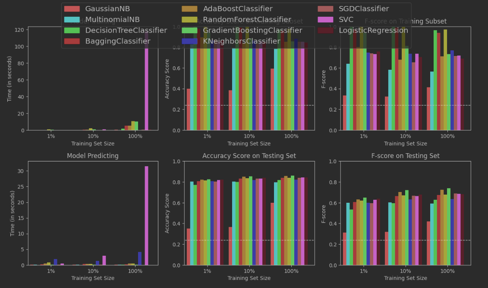

# Experiment: Comparing performance of sklearn's ML algorithms

In this assignment from Udacity's Machine Learning course, I compared several ML algorithms to classify individuals as having >50K income or not. I followed the instructions from the Udacity assignment to perform exploratory data analysis, "one-hot" encode some features, train different models in the `sklearn` libarary to fit the data and then validate against the testing data set: [T_finding_donors.ipynb](starter%2FT_finding_donors.ipynb)

This was a simplified classification problem with only several features, mainly for practice purpose and to reinforce what I am learning in Machine Learning, so I did not have many observations from the results.

With that said, the results seem to confirm my prediction that tree-based machine learning techniques may overfit the data (or "memorize the data"). That can be seen in the graph, where `DecisionTreeClassifier` or `BaggingClassifier` or `RandomForestClassifier` achieved close to 100% in the training set, while underperformed in the testing set relative to other ML algorithms. (My apology for the clumsy graph!)

The best candidate, in this problem instance only, seems to be `GradientBoostingClassifier`, which does not overfit the data and achieves the best accuracy and F-score in the training set.

